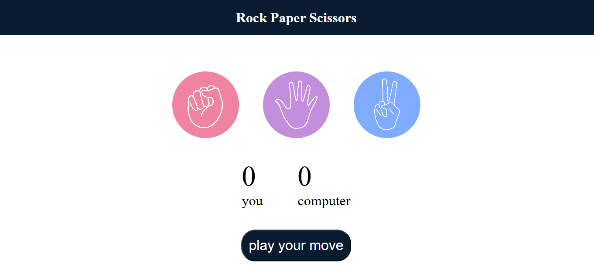
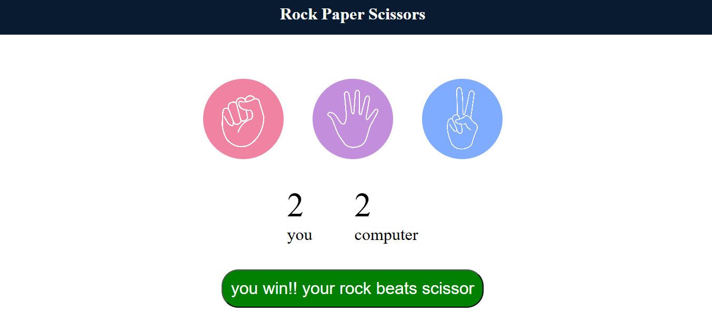
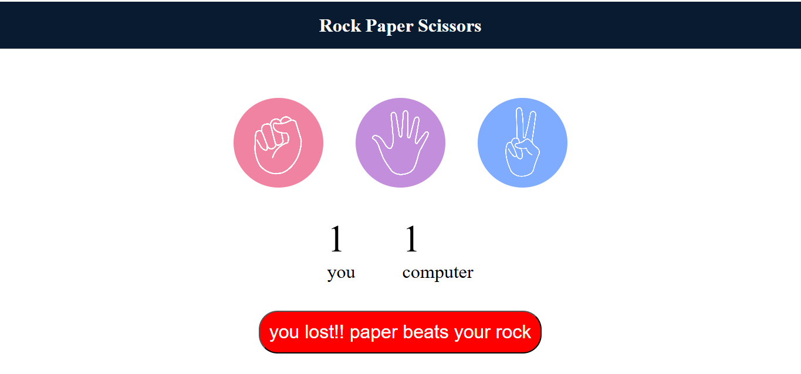
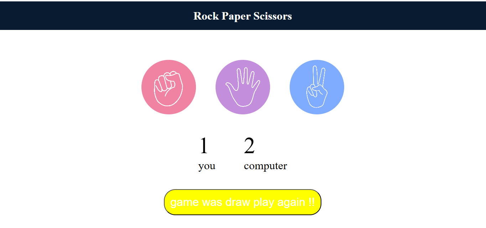

## Rock Paper Scissors Game
This project is a web-based Rock Paper Scissors game developed using HTML, CSS, and JavaScript.
In this game, the user plays against the computer by selecting Rock, Paper, or Scissors, while the computer makes a random choice. The winner is determined based on standard Rock Paper Scissors rules.

The game interface displays three hand images in the center of the screen, making the gameplay interactive and visually appealing.

## Features
-Single-player gameplay (User vs Computer)
-Clickable Rock, Paper, and Scissors images
-Real-time score tracking for both players
-Instant win, loss, or draw result display

-Color-coded result messages:
🟢 Green – Win
🔴 Red – Loss
🟡 Yellow – Draw

## Technologies Used
- HTML
- CSS
- JavaScript 

## Screenshots

## How to Run
Download or clone the project
Open the index.html file in any modern web browser
Start playing and enjoy the game 🎉

## Author
Yasaswa Ambati